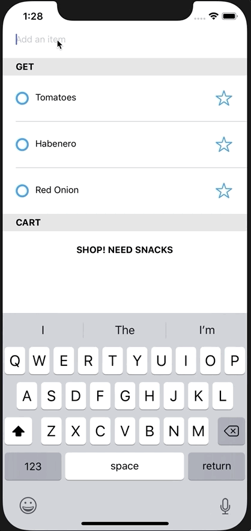

# React Native Grocery List

An example app, made with React Native, to manage your grocery list.

## Features

- Ability to add items to your list
- Ability to check/uncheck items in your cart
- Swipe to delete items from your list
- Persists list between sessions (via AsyncStorage)
- Ability to favorite certain items and use those to pre-populate a new list
- In dev mode, do a long double press to completely reset the app
- Minimal dependencies

## Running the App

```
$ git clone https://github.com/HandlebarLabs/react-native-grocery-list.git
$ cd react-native-grocery-list
$ yarn install
$ yarn run ios OR yarn run android
```


